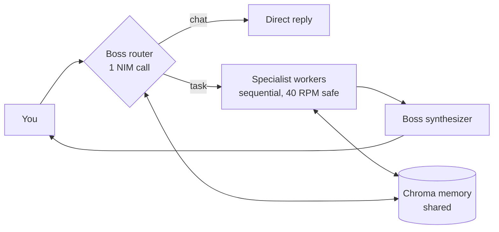

<div align="center">


[](https://www.python.org/)
[](https://build.nvidia.com)
[]()
[]()

**Chat with a team of AI agents that do real work — research, code, stocks, crypto, flights, live news, leads, scraping, images.**
One smart **boss** decides whether to answer directly or split the job across specialists. One API key. No OpenAI/Anthropic keys.

[Quickstart](#-run-it-60-seconds) · [What it can do](#-what-can-it-do) · [The team](#-the-team) · [Troubleshooting](#-troubleshooting) · [How it works](#-how-it-works)

</div>

---

## ⚡ Run it (60 seconds)

**1. Setup** — Python 3.10+, then:

```bash
git clone https://github.com/SPARKEDIX/BOT-Agency.git
cd BOT-Agency
py -m venv .venv
.venv\Scripts\activate        # Windows
# source .venv/bin/activate   # macOS / Linux
pip install -r requirements.txt
py -m playwright install chromium   # one time, for web scraping
copy .env.example .env        # Windows
# cp .env.example .env        # macOS / Linux
```

Paste your free key (from [build.nvidia.com](https://build.nvidia.com) → profile → API keys) into `.env`:

```
NVIDIA_API_KEY=nvapi-xxxxxxxxxxxxxxxx
```

> `.env` is git-ignored — your key never leaves your machine.

**2. Launch** — pick one:

```bash
py backend/server.py --open     # 🌐 browser chat UI (easiest)
py main.py                      # 💬 terminal chat
py main.py "Analyse RELIANCE on NSE" --pipeline   # single task, secure mode
```

> Open the printed `http://127.0.0.1:8000` URL. Do **not** double-click `frontend/index.html` — chat can't reach the backend that way.

---

## 🎯 What can it do?

Just type normally. The boss **chats directly** for greetings and **splits real tasks** across agents automatically. Copy-paste any of these:

```
hi, who are you?
Top world news right now
Should I buy BTC? Give strategy with latest news
Analyse RELIANCE on NSE with risks
Track AI202 from DEL to BOM — is it delayed?
Summarize https://www.youtube.com/@SPARKEDIX
Find 5 AI automation agencies in India with contacts
Compare Notion vs Obsidian pricing and features
Extract the pricing table from https://example.com/pricing as JSON
Generate an image of a cat in a library
Research the SPARKEDIX GitHub profile and list top repos
```

<details>
<summary><b>🧭 Modes — when to use which</b></summary>

| Mode | Flag / command | What happens | NIM calls |
|---|---|---|---|
| `auto` (default) | — | Boss routes: chat = direct reply, task = split to agents | 1 for chat, up to ~6 for tasks |
| `direct` | `--direct` / `/direct` | Single boss call, no workers (best when NIM is busy) | 1 |
| `agency` | `--agency` / `/agency` | Forced plan → workers → synthesize | up to ~6 |
| `pipeline` | `--pipeline` / `/pipeline` | Secure LangGraph run with trace + safety guards | up to ~6 |

**Tip:** if answers time out, switch to `/direct` and retry — NIM gets overloaded at peak hours.

</details>

<details>
<summary><b>⌨️ Chat commands</b></summary>

Type `/` alone to list every command, Tab to complete, and a typo like `/agnts` suggests the closest match.

| Command | Action |
|---|---|
| `/help` | Show all commands |
| `/agents` | List every agent + model |
| `/model <name>` | Show or switch the boss model |
| `/auto`, `/direct`, `/agency`, `/pipeline` | Switch mode |
| `/stream` | Toggle token streaming |
| `/memory`, `/memory clear` | Show Chroma docs / wipe memory |
| `/clear` | Clear screen |
| `/quit` | Exit |

</details>

---

## 🤖 The team

| Agent | Job | Model |
|---|---|---|
| Boss (`main_agent`) | Routes chat vs task, plans, synthesizes | `nvidia/nemotron-3-ultra-550b-a55b` |
| `researcher` | Facts, outlines, comparisons | boss model |
| `coder` / `coding` | Code, debugging | boss model |
| `writer` | Docs, copy, summaries | boss model |
| `reviewer` | Critiques + improves drafts | boss model |
| `scraper` | Any URL → summary (ScrapeGraphAI, Playwright fallback) | boss model |
| `yt_scraper` | YouTube channel/video/search → stats + summary | boss model |
| `lead_gen` | ICP → scored lead table (never invents contacts) | boss model |
| `marketing` | Product URLs → brief + competitor table + angles | boss model |
| `url_data` | Any URL → tables / lists / JSON, verbatim | boss model |
| `trading` | India NSE/BSE analyst: price + fundamentals + technicals, live news + strategy | boss model |
| `flight_tracker` | Live flight status: times, delays, gates (FlightAware/FR24) | boss model |
| `crypto` | Crypto analyst (BTC/ETH/…): price, market, live news + strategy | boss model |
| `news` | Real-time world news: live RSS headlines with sources | boss model |
| `image_maker` | Text → JPG image via FLUX.1-schnell (`./outputs`) | `black-forest-labs/flux.1-schnell` |

Every agent shares **one Chroma vector memory** (`./chroma_db`): each recalls relevant past work into its prompt and stores its result. Disable with `--no-memory`.

Shared **40 requests/minute** budget: one rate limiter (1.5 s spacing), workers run sequentially, transient NIM errors auto-retry 5× with backoff. The browser UI auto-retries failed multi-agent runs once as Direct.

---

## 🔧 Configuration (`.env` / environment)

| Variable | Default | Purpose |
|---|---|---|
| `NVIDIA_API_KEY` | — | **Required.** Single key for all models |
| `SCRAPER_MODEL` / `YT_SCRAPER_MODEL` / `LEAD_MODEL` / `MARKETING_MODEL` / `URL_DATA_MODEL` / `CODING_MODEL` / `TRADING_MODEL` / `FLIGHT_MODEL` / `CRYPTO_MODEL` / `NEWS_MODEL` | see `config.py` | Per-agent model override (or `WORKER_MODEL_<ROLE>`) |
| `CHROMA_PATH` | `./chroma_db` | Vector memory location |
| `MEMORY_TOP_K` / `MEMORY_ENABLED` | `3` / `1` | Recall depth / on-off |
| `MEMORY_EMBEDDING` | `hash` | `hash` = offline, `default` = ONNX MiniLM |

---

## ✅ Test (no key needed)

```bash
py test_agency.py     # 25 offline checks (mocked API): routing, all agents, retries, memory, pipeline
py test_frontend.py   # 4 offline checks: design tokens, a11y, API wiring, design.md
```

---

## 🆘 Troubleshooting

| Problem | Fix |
|---|---|
| `NVIDIA_API_KEY missing` | Put a real key in `.env` (not the `PASTE_` placeholder), restart the server |
| `Service temporarily overloaded` / 502 | Server-side, not your code — wait 30–60 s and retry, or use `--direct` / Direct mode (1 call instead of ~6) |
| `429 / rate limit` | 40 RPM budget hit — the limiter + retries handle it; wait a minute |
| Browser shows "backend unreachable" | Start the server (`py backend/server.py --open`) and use the `http://127.0.0.1:…` URL — don't open the HTML file directly |
| Chat spinner never ends | NIM can take 30–90 s on tasks; use Cancel, then retry in Direct mode |
| Playwright `Executable doesn't exist` | Run `py -m playwright install chromium` |
| `scrapegraphai` install fails | Optional — the scraper auto-falls-back to Playwright |
| Empty page / login wall | Some sites block bots; the agent reports it instead of guessing |
| Slow image generation | FLUX can take minutes when busy; check `./outputs` for the finished file |

---

## 🧠 How it works



* **CLI** (`main.py`): Claude-style REPL + single-shot with slash commands.
* **Browser UI** (`frontend/` + `backend/server.py`): zero-dependency localhost server, token-driven dark UI (`design.md`), Three.js ambient background, same-origin `/api/chat`.
* **Secure mode** (`agency/pipeline.py`): LangGraph run with input sanitization, API-key redaction, SSRF URL filtering, per-agent error isolation, 10-step budget, fail-closed errors with full trace.

```
main.py               # Claude-style CLI (REPL + single-shot)
backend/server.py     # localhost server: serves frontend/ + /api/chat
frontend/             # browser UI (index.html, styles.css, app.js, bg.js)
config.py             # key, endpoint, models, budgets
design.md             # UI design tokens + component rules
assets/banner.svg     # animated README banner
test_agency.py        # 25 offline tests, no key needed
test_frontend.py      # 4 offline UI tests, no key needed
agency/
  main_agent.py       # boss: router + planner + synthesizer
  worker.py           # dispatches every role
  registry.py         # agent list, prompts, model mapping
  nim_client.py       # shared NIM client (streaming + retries)
  rate_limiter.py     # 40 RPM shared limiter
  pipeline.py         # secure LangGraph graph (blackboard + guards)
  memory.py           # Chroma vector store
  agent_memory.py     # memory mixin for all workers
  scraper.py  yt_scraper.py  lead_gen.py  marketing.py  url_data.py
  trading.py  flight_tracker.py  crypto.py  news.py  image_maker.py
```

## 🔒 Security notes

The `--pipeline` mode adds: input sanitization, API-key redaction from prompts/logs/memory, SSRF URL filtering (blocks localhost, private networks, cloud metadata IPs, credentials in URLs), per-agent error isolation, a 10-step budget, and fail-closed errors with a full trace.

---

<div align="center">
<sub>Built with one NVIDIA key · PRs welcome · Not financial advice — verify market and flight data with the provider before acting.</sub>
</div>
